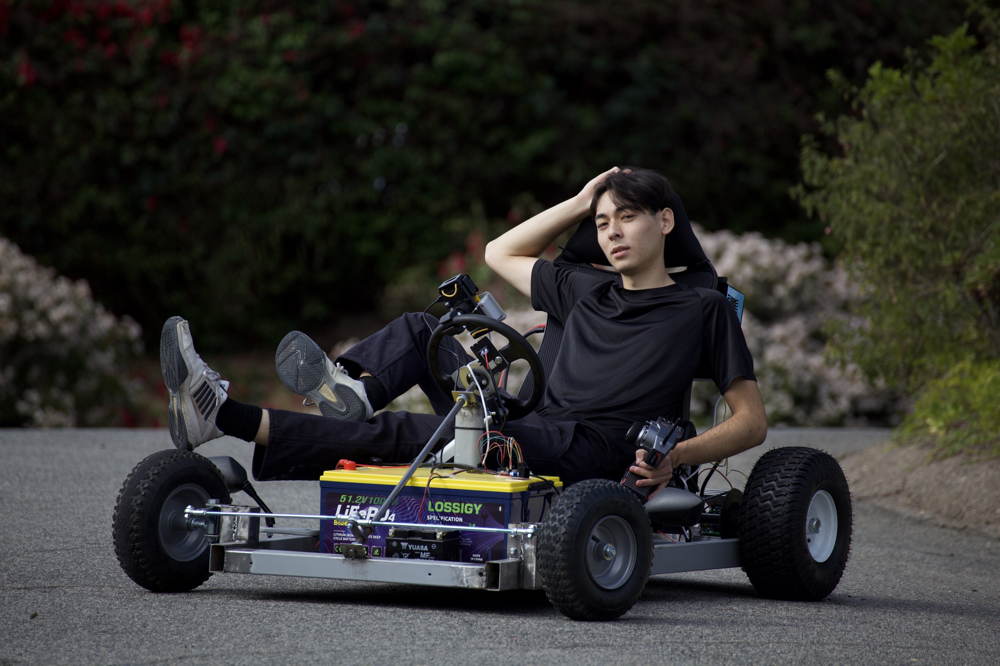

<h1 align="center">Treadmill Go Kart</h1>

Files and information related to my treadmill go kart project.

## Electrical specifications
- Motor: 2.6 kWh DC (treadmill motor)
- Motor Controller: mc2100 treadmill controller
- Battery: 5120wh, 10kWh max discharge, 48v, LFP cells
- Inverter: 48v, 4000w nominal output, 8000w peak output

## Remote control system
I'm using an Arduino UNO R4 to orchestrate the RC system. It's being powered with the 5 volt output of the treadmill controller. The 5 volt output of the arduino goes to powering the reciever. I'm using two linear actuators, one to control the brakes, and one for the steering. Both are powered by an h-bridge motor controller and 12v motorcycle battery.

